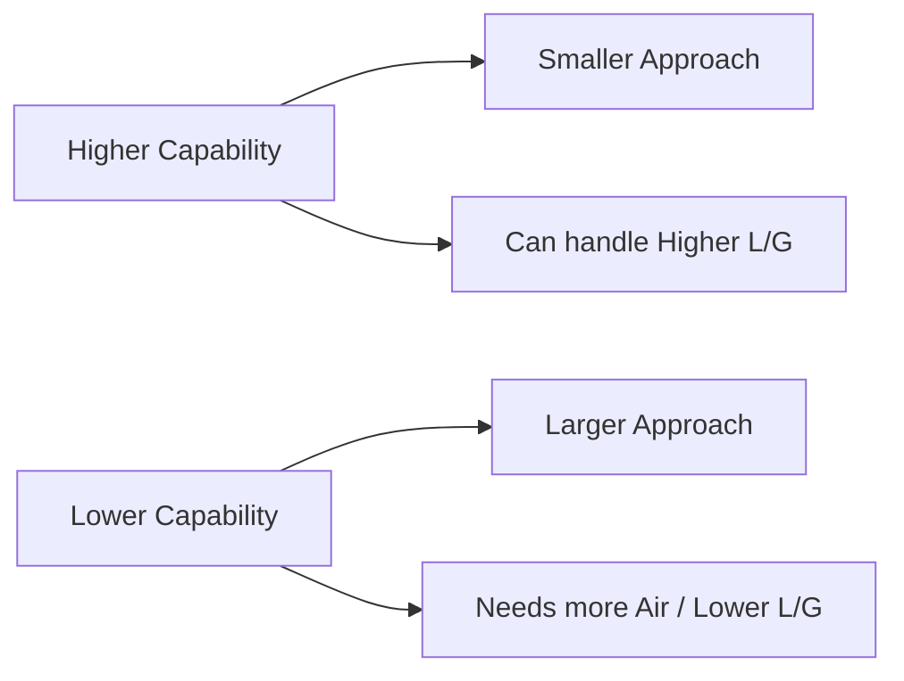

# SS Cooling Tower Dashboard - Engineering Fundamentals

This document provides a "First Principles" and "Logic-driven" explanation of cooling tower performance, based on the **CTI ATC-105 standards**. 

As a software developer building this dashboard, understanding the physics behind the code is crucial for building robust, professional-grade tools.

---

## 1. The Cooling Process: Evaporative Cooling
**Analogy: A Cricketer in Humidity vs. Aridity.**

Cooling towers do not simply blow cold air over hot water (this is what a radiator or "dry cooler" does). Instead, they rely on **Evaporative Cooling**—swapping heat for humidity.

### Key Concept: Latent Heat of Vaporization
To turn a single gram of liquid water into water vapor, the molecule needs a massive amount of energy (the "tax" to enter the gas phase). It takes this energy from the surrounding water, leaving the remaining liquid colder.

> [!NOTE]
> By evaporating just **~1% to 1.5%** of the water flow, you can cool the remaining **98.5%** of the water by **10–12°C**. This is incredibly energy-efficient compared to trying to cool it with blowers alone.

---

## 2. The 4 Pillars of Cooling Data
These four numbers are the "Scoreboard" of your dashboard.

| Pillar | Symbol | Real-World Meaning | The "Cricketing" Logic |
| :--- | :--- | :--- | :--- |
| **Hot Water Temp** | **HWT** | The temperature of the water entering the tower from the factory. | **The Target:** The massive score the other team set. You *must* deal with this. |
| **Wet Bulb Temp** | **WBT** | The absolute lowest temperature air can reach via evaporation. | **The Pitch Condition:** The theoretical limit of cooling. You can NEVER cool water below this. |
| **Cold Water Temp** | **CWT** | The temperature of the water exiting the tower, going back to cool the factory. | **The Performance:** How well your team actually batted against the target. |
| **L/G Ratio** | **L/G** | The ratio of the Mass Flow of Water (Liquid) to the Mass Flow of Air (Gas). | **The Team Balance:** The ratio of batters to bowlers. |

### Derived Metrics: The True KPIs
*   **Range (HWT - CWT):** How much total heat was removed? (The score you made).
*   **Approach (CWT - WBT):** How efficient is the tower? A "Close Approach" (e.g., 4°C) means a very powerful tower. A "Large Approach" (e.g., 10°C) means the tower is struggling or undersized.

---

## 3. The Engine Logic: L/G Ratio
**The Liquid-to-Gas Ratio is the "Heart" of the Merkel Engine.**

In your `merkel-engine.js`, the term `lg` determines the slope of your "Air Operating Line."

*   **High L/G:** Lots of water, very little air. The air gets saturated quickly and stops cooling. (Low energy cost, poor cooling).
*   **Low L/G:** Massive amounts of air, very little water. Exceptional cooling, but very high fan electricity costs.

> [!TIP]
> Cooling tower design is a "Goldilocks" problem: finding the L/G ratio that provides the required **Approach** for the lowest possible energy cost.

---

## 4. The Merkel Method: "Demand" vs. "Supply"
The Merkel Method is the industry standard for cooling tower thermal analysis. It splits the problem into two numbers:

### A. Demand (KaV/L) - "The Difficulty"
Calculated using the thermal conditions (HWT, CWT, WBT) and the L/G ratio. It answers: 
> *"Mathematically, how hard is this cooling task?"*

### B. Supply (Characteristic) - "The Skill"
Every physical tower has a "Characteristic Curve" based on its physical design (the type of "Fill" inside, the fan size, the nozzle spray pattern).
> *"Physically, how much cooling can this specific tower provide?"*

**The "Winning" Rule:**
If **Supply ≥ Demand**, the tower is performing correctly.
If **Supply < Demand**, the tower is "failing" (the water will be warmer than expected).

### The Math (Chebyshev 4-Point Integration)
The Merkel equation is an integral:  
$KaV/L = \int_{CWT}^{HWT} \frac{dT}{h_w - h_a}$

Your code uses the **Chebyshev 4-Point method** (at points 0.1, 0.4, 0.6, and 0.9 of the Range) to solve this integral precisely, matching the **CTI Toolkit**.

---

## 5. Efficiency and Performance Correlation
A high-performing tower is defined by its **Capability**. 

### Why Altitude Matters
In your `altToPsi()` function, you account for atmospheric pressure. 
*   **Sea Level:** Air is dense (heavy). It can carry more heat per cubic meter.
*   **High Altitude:** Air is thin. You need a BIGGER fan (more air volume) to do the same amount of cooling.

---

## Summary for Developers
When debugging your dashboard's charts:
1.  **If Range increases:** Demand (KaV/L) goes up.
2.  **If Wet Bulb increases:** Demand goes down (it's actually easier to cool water when it's hot and dry).
3.  **If L/G increases:** The "Air Enthalpy" line gets steeper, making it harder to maintain a cold CWT.

---
*Created by Antigravity AI Mentor for the CTI Suite Final project.*
